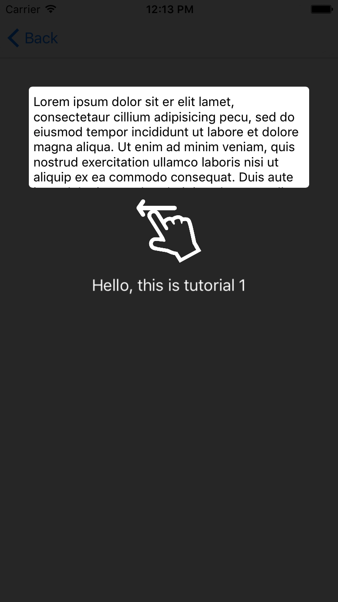

# KJOverlayTutorial
An convenient way to display tutorial overlay for iOS

# Release

## 1.0.0
+ Initial release
+ Support Swift 3.x

## 2.0.0
+ Add animations
+ Support Swift 4.x

# Usage

### Text with Icon Tutorial
```swift
// tut1
let focusRect1 = self.tvTut.frame
let icon1 = UIImage(named: "ico_hand")!
let icon1Frame = CGRect(x: self.view.bounds.width/2-72/2, y: focusRect1.maxY + 12, width: 72, height: 72)
let message1 = "Hello, this is tutorial 1"
let message1Center = CGPoint(x: self.view.bounds.width/2, y: icon1Frame.maxY + 24)
let tut1 = KJTutorial.textWithIconTutorial(focusRectangle: focusRect1, text: message1, textPosition: message1Center, icon: icon1, iconFrame: icon1Frame)

// tuts
let tutorials = [tut1]
self.tutorialVC.tutorials = tutorials
self.tutorialVC.showInViewController(self)
```
</br>

### Multiple Tutorial
```swift
// tut1
let focusRect1 = self.imvTut.frame
let message1 = "Hello, this is your avatar"
let message1Center = CGPoint(x: self.view.bounds.width/2, y: focusRect1.maxY + 24)
var tut1 = KJTutorial.textTutorial(focusRectangle: focusRect1, text: message1, textPosition: message1Center)
tut1.isArrowHidden = true

// tut2
let focusRect2 = self.btnTut1.frame
let icon2 = UIImage(named: "ico_hand1")!
let icon2Frame = CGRect(x: self.view.bounds.width/2-72/2, y: focusRect2.maxY + 12, width: 72, height: 72)
let message2 = "Tap to update your profile"
let message2Center = CGPoint(x: self.view.bounds.width/2, y: icon2Frame.maxY + 24)
let tut2 = KJTutorial.textWithIconTutorial(focusRectangle: focusRect2, text: message2, textPosition: message2Center, icon: icon2, iconFrame: icon2Frame)

// tut3
let focusRect3 = self.btnTut2.frame
let icon3 = UIImage(named: "ico_hand1")!
let icon3Frame = CGRect(x: self.view.bounds.width/2-72/2, y: focusRect3.maxY + 12, width: 72, height: 72)
let message3 = "Tap to update your payments"
let message3Center = CGPoint(x: self.view.bounds.width/2, y: icon3Frame.maxY + 24)
let tut3 = KJTutorial.textWithIconTutorial(focusRectangle: focusRect3, text: message3, textPosition: message3Center, icon: icon3, iconFrame: icon3Frame)

// tut4
let focusRect4 = self.btnTut3.frame
let icon4 = UIImage(named: "ico_hand1")!
let icon4Frame = CGRect(x: self.view.bounds.width/2-72/2, y: focusRect4.maxY + 12, width: 72, height: 72)
let message4 = "Tap to edit your settings"
let message4Center = CGPoint(x: self.view.bounds.width/2, y: icon4Frame.maxY + 24)
let tut4 = KJTutorial.textWithIconTutorial(focusRectangle: focusRect4, text: message4, textPosition: message4Center, icon: icon4, iconFrame: icon4Frame)

// tuts
let tutorials = [tut1, tut2, tut3, tut4]
self.tutorialVC.tutorials = tutorials
self.tutorialVC.showInViewController(self)
```
</br>